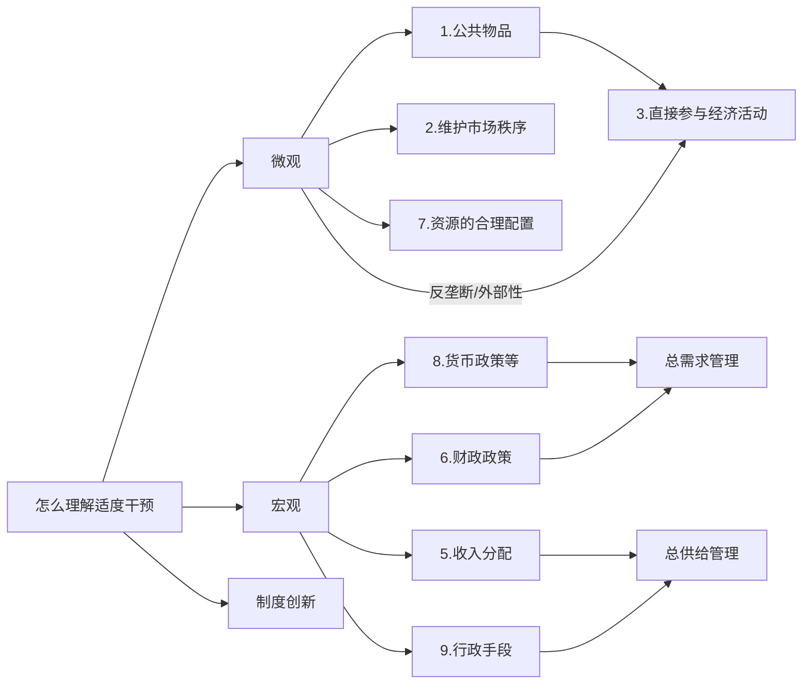

### 第5章 国有企业的治理

一.利益相关者合作逻辑与国有企业治理结构创新原则

**企业治理结构**：是一种**契约制度**，通过一定的治理手段合理配置剩余**索取权**和**控制权**，以使企业内的**不同**利益主体形成有效的**自我约束**和**相互制衡**机制。（3分）——所谓”相互制衡“如：重大事件需要党政联席来定。

- 企业治理的核心是**激励**与**约束**经理人行为。—— 兵熊熊一个，将熊熊一窝

   委托代理问题：资本**所有权**和**控制权**分离。委托人【国资委】和代理人【管理层】的目标不一致（逆向选择和道德风险）

   委托代理关系下激励和约束机制的设计：

   1. **原则**：代理人实现自身利益最大化同时实现委托人利益最大化。—— 比如：期权，销售提成

   2. **基本约束条件**：一是**刺激一致性约束**；二是**个人理性约束**。
   3. 降低代理成本：代理成本包括,酬金奖金、非货币物品、效率损失。（1）最优的激励约束机制（2）通过市场制度降低代理成本：经理劳务市场，产品市场，资本市场。（3个评价机制）

二.股东至上主义企业治理模式面临的挑战

“股东至上”困境，一切为了股东侵害了利益相关者利益。

三.国有企业治理结构创新：共同治理。（略）利益相关者逻辑


### 第6章 社会主义市场经济条件下的分配制度

> 按劳分配与按要素分配：

多种分配方式并存：分配方式由所有制决定。

#### 一.如何理解按劳分配与按生产要素分配相结合：（简答）

1. 按劳分配与按要素分配相结合是收入分配的**劳动标准**与**所有权标准**相结合。—— 标准
2. 按劳分配与按要素分配相结合是**按劳分配的实现形式**（工资）与**按要素分配的实现形式**（利润/租金/红利等)相结合。—— 实现形式
3. 在社会主义初级阶段，实行按劳分配与按要素分配相结合，不仅有利于调动劳动者和生产要素所有者的**积极性**，促进劳动和资本的**积累**。而且有利于生产要素的**有效合理利用**。——好处

#### 二.社会主义市场经济中生产条件分配与收入分配之间的关系如何？

​        收入或产品的分配取决于生产条件的分配。生产条件包括生产的物质条件(即客观生产条件)和生产的劳动力条件(即主观生产条件)。

1. 在我国现阶段，客观生产条件在社会成员之间的分配，涉及公有制生产条件的分配和非公有制生产条件的分配。客观生产条件的多种所有制形式，相应要求多种分配方式与此相适应。
2. 从主观生产条件看，在任何生产中，劳动力始终是生产的一个要素，但劳动力以何种形式参与生产，直接影响收入分配的结果。

#### 三.收入分配过程

- **微观收入分配过程：**（市场机制）
  1. 定义：在**市场机制的作用**下，微观主体按照**社会必要劳动时间**来确定和分配价值的过程。
  2. 过程：在这一过程中，企业取得收入的多少，既取决于其单个产品生产上是否符合及在多大程度上符合社会必要劳动时间标准，也取决于该部门生产总量是否符合及在多大程度上符合第二种社会必要劳动时间标准。
  3. 意义：微观收入分配是通过**市场机制**进行的，市场机制能够强化收入分配的**刺激作用**，有助于调动所有者积极性，但是单靠市场机制不能有效地调节和平衡各方利益关系，不能维护社会公平。——“做到了效率，但做不到公平”
- **宏观收入分配过程：**（税收+社会保障+转移支付）
  1. 定义：是建立在微观收入分配过程基础上并独立于这一分配过程的在**再分配**过程。它要考虑社会各个方面的利益的平衡和社会整体、长远发展需要，对不同部门、不同领域、不同社会成员之间的收入分配关系进行调节，促进谁会公平与和谐的过程。
  2. 意义：宏观收入分配的调节一方面**通过税收**把高收入者的部分收入转移到国家手中，另一方面通过**国家预算支出**保障非生产领域发展的需要。利用转移性支付和社会保障制度等为低收入者提供收入保障。
- **效率优先兼顾公平**

#### 四.如何理解和实现社会主义市场经济条件下收入分配的公平

1. 收入分配不公的根源是生产条件分配不公。

   ​        公平有初次分配中的公平和再分配中的公平之分。初次分配中的公平与生产条件的分配相联系，并由生产条件的分配所决定。

   ​		再分配中的公平与社会各方面利益的平衡相联系。我国社会主义市场经济运行中，既要重视再分配中的公平与效率，也要重视初次分配中的公平与效率的问题。

2. 实现对策：

   1. 规范制度、强化约束，防止在市场化分离中，各种代理人控制公有生产条件，进而控制公有约束。（**限高**：防止代理人侵贪委托人的权利）
   2. 统一制度安排，实行统一国民待遇。（**国民待遇**）
   3. 消除市场分割。促进生产条件在不同部门之间的均衡分配。（**促流动**）
   4. 加强对弱势群体的权利保护，增加对他们的人力资本的投资，改善他们的收入状况。 （**促低**）


### 第七章 社会主义经济增长与经济发展

一.经济增长与经济发展

经济发展：既包括**更多的产出**，也包括产品生产和分配所依赖的**技术**和**体制**安排上的变革。

二.人均GDP或GNP不能完全反映一国的经济发展水平主要有以下几个方面原因

1. 没有充分反映国民生产总值的分配情况。
2. 人口因素
3. 非市场的产品和劳务没有计算在内
4. 不能反映从使用产品或服务中得到的福利水平（例如：污染）
5. 不能反映生活质量(例如：预期寿命)

三.平衡增长和非平衡增长

1. 平衡增长：通过实施全面增长计划，是各种工业同时有所发展
2. 非平衡增长：将经济发展过程看作是不同部门先后不同的成长，并互相联系彼此施加压力和推力的结构演化过程。（中国）

#### 四.为什么说经济增长方式的转变必须依赖于制度创新

> 粗放型增长和集约型增长  
>
> 体制条件：粗放型增长方式以传统公有制和计划经济为基础，而集约型增长方式以**市场经济和技术创新**为基础。

1. 经济增长方式的转变：粗放型向集约型转变。

2. 经济增长方式的转变取决于**技术进步**，而技术创新在相当大程度上依赖于**体制创新**。

3. 体制创新之所以能推动或阻碍经济增长方式的转变，是因为体制变化具有既改变收入分配，又改变资源使用效率的潜在可能性。

   （1）体制为经济人规定了行为规则和约束条件

   （2）体制创新可以塑造新的激励机制，激发技术创新的动机

   （3）新的伦理道德规范有利于克服机会主义，以较低的代价换取较快的增长。

   （4）体制因素还影响信息和资源的可获得性

4.技术进步：(1)工业化（2）自动化（3）机械化（4）产业结构高级化

```flow
graph LR

A[体制创新]
D[技术进步]
A -->B[改变收入分配]

A -->C[资源的有效组合]
B -->D
C -->D
D -->|四化| E[经济增长方式转变]
subgraph
F[体制因素]-->G1[行为规则和约束条件]
F -->G2[激励机制,激发创新动机]
F -->G3[新的伦理道德规范,克服机会主义]
F -->G4[信息和资源的可获得性]
end

```


#### 五.制度的机理

> 制度：规则、首发程序和行为伦理道德规范。1.宪法秩序 2.制度安排 3.行为伦理道德规范

制度是通过以下三个环节影响经济增长的

1.产权：（产权制度）减少未来不确定性和避免产生机会主义。

2.国家：（法律制度）界定和保护产权来降低交易费用。

3.意识形态：（伦理道德制度）解决不付费搭车问题，节约交易费用。

#### 六.发展观

1.邓小平的经济发展理论

1.1 分三步走的台阶式发展战略：上世纪走两步，达到温饱和小康，本世纪再走一步，达到中等发达国家水平

（1）提出战略目标是实现四个现代化

（2）提出分三步走的战略步骤

（3）重点：一是农业，二是能源和交通，三是科学和教育

1.2 “科教兴国”战略

2.可持续发展与科学发展观

- 经济发展模式：**国家发展战略**及生产**要素增长机制**、**运行原则**的特殊类型。包括发展目标、方式、重点、步骤等等。
- 可持续发展：既满足当代人需要，又不对后代人满足需求能力构成危害的发展，核心：发展
- 基本原则：持续性(资源)、公平性（代际）、共同性（发展中国家和发达国家）
- 中国面临的问题：1.资源、环境承载力 2.观念上的偏差 3.战略机制缺陷
- **科学发展观：**

1.以人为本、促进人的全面发展是科学发展观的本质和核心

2.全面、协调和可持续发展是科学发展观的基本内容

3.统筹兼顾是科学发展观的根本要求

**高质量发展观**


### 第八章 社会主义市场经济条件下的经济结合调整

#### 一.二元经济结构

1. 二元经济：城市工业为主的现代部门和农村为主的传统部门并存

2. 衡量指标：

   （1）比较劳动生产力  { 产值与就业的劳动力比重的比例，一般来说 农业比较劳动生产率小于1 }

   （2）二元对比系数  { 农业比较劳动生产率与非农业比较劳动生产率的比率，理论上处于0到1之间 }

   （3）二元反差系数  { 指工业或非农业产值比重与劳动力比重之差的绝对值，与二元对比系数相反 }

#### 二.产业结构

1.影响产业结构调整的因素：

​	（1）社会需求：消费、投资、出口（AD=C+I+G )

​	（2）技术进步：形成新产业、改造传统产业、推动产业结构更新换代

​	（3）制度安排：影响资源配置和产业结构调整

​	（4）资源供给：自然资源、人力资源和资金资源

#### 三.技术进步和结构调整


 ### 第九章 社会主义对外开放

经济开放：经济体系通过产品、服务、技术、要素等流动与外界发生联系

#### 一、经济开放的必然性：

1. 分工带来生产效率的提高是经济增长的源泉，而交换是解决分工内生矛盾的手段。
2. 市场经济本质上是开放的，市场在规模和流动性上存在“阈值效应”。
3. 市场本性和分工的互动关系，都决定了市场具有内在的开放冲动。

二、**FDI**（foreign direct investment）**通过哪些渠道影响我国的经济增长**？

​		最直接的渠道是通过资本流动变化影响一国宏观经济运行过程，主要有：对外借款、证券资金跨境流动和外商直接投资。

1. FDI对中国经济增长作用主要表现为资本要素的积累

2. 外资企业可以促进我国产业结构升级。
3. FDI所获得的外溢效应和贸易诱发的干中学效果。
4. FDI的流入还直接带动我国技术引进和进口的增加。

```mermaid
	graph LR
	A[开放]-->B[经常账户-贸易,商品/劳务]
	A-->C[资本/金融,FDI]
	B-->D1[理论上,分工/交换]
	B-->D2[实践上被证实]
	B-->D3[动态效应,技术进步]
	C-->E1[发展上,产业结构升级]
	C-->E2[行业上,技术外溢效应和干中学]
	C-->E3[贸易上,技术引进和出口增加]

	subgraph
	A1[开放的必然性]-->分工与交换
	A1-->市场的本质,规模和流动性
	A1-->市场内在的开放冲动
	end
```

#### 三、对外开放政策

1. 1982年，党的基本路线确立，对外开放是重要内容。
2. 1984年，《关于经济体制改革的决定》把对外开放作为长期基本国策。
3. 1992年，提出扩大对外开放的三个主要目标和任务。（沿海，沿边，沿江；引进来，走出去）
4. 2001年，我国加入世贸组织，成为提高对外开放水平的新起点。

#### 四、对外开放政策

1. 从“进口替代”到“出口导向”，再到全面开放。（2001年之后，部分领域还没放开，今年受国际打压）

2. 渐进的开放战略与**全方位、多层次、宽领域**对外开放格局的形成。


####   第十章 社会主义市场经济条件下的政府调节

#### 一.政府调节经济的必然性

1.市场机制并非尽善尽美

市场失灵：市场资源配置失灵4点：垄断、公共物品、外部性、信息不对称，收入分配不公平，经济波动。

2.政府纠正能力是有限的

政府失灵：决策失灵（投票机制、政治家的主体行为动机、利益集团）

​				   运转失灵（垄断导致无效率、缺乏低成本的激励导致无效率）

​				   干预失灵（利益寻租--许可证、配额、执照、授权书等）。

3.政府干预的优势

- 征税权：解决外部性等市场失灵

- 禁止权：维护市场秩序，增加福利 （如：去产能）

- 处罚权：维护市场秩序，产业结构调整

- 节约交易费用

Tax,Prohibit,Fine(罚款),Cost   TPFC

政府可以调节经济，做到：产业协调，部门协调，**社会经济关系协调**，**短期目标**与**长期目标**协调，**总量平衡**与**结构平衡**协调。市场可以做好**资源配置**与微观**效率提高**。

政府——协调  市场——效率

#### 二.政府干预经济的功能界定与范围界定

怎么理解适度的政府干预（20分）

1. 提供公共物品
2. 维护市场秩序（反垄断）：处罚、禁止等
3. 直接参与某种经济活动
4. 制度创新
5. 影响收入分配
6. 具有财政调节功能
7. 资源的合理使用
8. 运用适当的经济政策实现一定的宏观政策目标
9. 进行必要的行政控制


